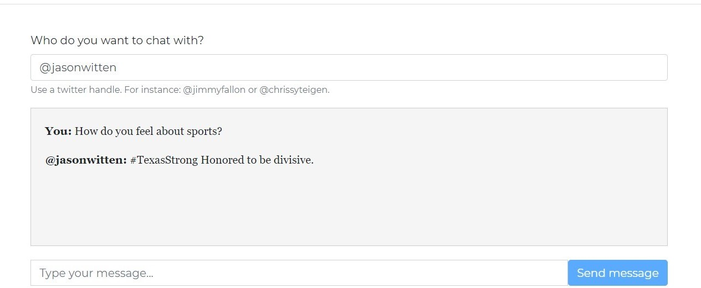

# Markov-Chain-Twitter-Chatbot
 
This is a Markov chain bot that allows the user to chat with a celebrity. The user would enter any existing twitter handle of a celebrity, along with a message, and they would receive an intelligent response back, which would be a random tweet pulled from the Twitter API.

### static/script.js

This is the file that makes the website interactive.

### static/style.css

This is the file that styles the website so that it doesn't just look like plain text. 

### templates/homepage.html

This is the index file of the webpage. When a user navigates to the webpage, it will automatically open homepage.html. 

### config.py

This file specifies some settings for the app. 

### Glitch.json

This file makes sure that the app runs using the correct version of Python.

### main.py

This file handles the request and response cycle of the app. 

### markov_bot.py

This file retrieves Tweets from Twitter and uses some of the scraping techniques you learned in the previous workshop to return clean Tweets. 

### requirements.txt

This is a file that tells Glitch what Python libraries need to be installed. 
